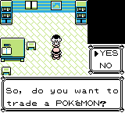
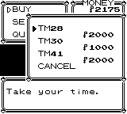
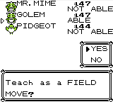
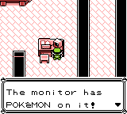

# Pokémon Solus RGB

<p align="center" style="margin-left: 10%; margin-right: 10%">

</p>

_Pokémon Solus RGB_ is a minimal, near-vanilla, faithful romhack of Pokémon Red/Blue for Game Boy, with a focus on an enhanced **solo gameplay experience**. It is based on the [disassembly of Pokémon Red and Blue][pokered].

For a detailed look at all the changes in this romhack, read the [Feature Log][featurelog]. For a video overview, watch the [trailer][trailer]. Join the [Solus Discord][solusdiscord] to offer any feedback.

Just want the patch? Download [here][releases].

Don't know where to start? Read the [beginner setup guide][howtoplay].

## Table of Contents
- [Elevator pitch](#elevator-pitch)
- [Versions](#versions)
- [Installation](#installation)
- [Screenshots](#screenshots)
- [Links](#links)
- [Credits](#credits)
- [Support the project](#support-the-solus-project)

## Elevator pitch

_Pokémon Solus RGB_ is a minimal, near-vanilla romhack of Gen 1 (Red & Blue). It aims to enhance the solo gameplay experience by mitigating the need for trading, and "forward-patching" some features and learnset updates from Yellow and Gen 2. It changes _only a few things_ from the original games, without overhauling so much that it ceases to be Gen 1 (and thus becomes a [Ship of Theseus](https://en.wikipedia.org/wiki/Ship_of_Theseus)).

### Quick overview of changes
1. All 151 Pokémon are obtainable through in-game means (without the need for in-game trades)
2. Field Moves: HMs can be taught to party Pokémon without using up one of their move slots
3. Four new TMs have been added to support forward-patched learnsets (Fire Punch, Ice Punch, Thunderpunch, Flamethrower)
4. Trades can be performed in-game via the Trader NPC
5. Battle HUD additions: EXP bar and 'already caught' indicator
6. Professor Oak can be battled after beating the Pokémon League
7. Pokémon learnsets have been partially forward-patched via Yellow Version and Gen 2 tradeback learnsets
8. Exclusive Solus sprite set (a collection of the developer's favorites)
9. Some bugs/oversights from vanilla are fixed (Ghost is now super effective against Psychic, Focus Energy no longer quarters critical hit chance, etc.)

For a detailed look at _all_ the changes, check out the [Feature Log][featurelog].

## Versions

There are three versions of this romhack: _Solus Red_, _Solus Green_, and _Solus Blue_. The differences between versions are solely cosmetic (palettes, title screen text, etc.), as this project consolidates any of the meaningful version-specific differences that existed across versions, such as Pokémon availability. Check [here][versiondifferences] for a complete list of version differences.

_Note_: If played on Game Boy Color, _Solus Green_ uses the GBC's built-in green "duochrome" palette. This is the same one which was used by the Japanese release of Pokémon Green Version.

## Installation

### Patching a vanilla ROM

To patch a vanilla Pokémon Red/Blue Version ROM, download a `.bps` patch file from the [releases page][releases], and then apply it to your ROM using [this online patcher](https://www.marcrobledo.com/RomPatcher.js/) or your patcher of choice.
- For _Solus Red_ or _Solus Green_, patch a vanilla Pokémon Red ROM
- For _Solus Blue_, patch a vanilla Pokémon Blue ROM

ROM hashes for reference:  
```
Pokémon Red
CRC-32: 9f7fdd53
SHA-1: ea9bcae617fdf159b045185467ae58b2e4a48b9a

Pokémon Blue
CRC-32: d6da8a1a
SHA-1: d7037c83e1ae5b39bde3c30787637ba1d4c48ce2
```

### Building all three ROMs from source

If you're new to the [`pokered`][pokered] disassembly, learn how to install prerequisites and build the ROMs in the [install guide][installation].

Otherwise, if your environment for building the vanilla ROMs is already set up, the procedure here is the same. Just clone this repository, `cd` into it, and run `make`.

### Modifying this romhack
If you want to make some tweaks to this romhack before building the ROMs, or if you want to use this romhack as a starting point for your own, read [this document][howtomod] that I've written.

## Screenshots
<details>
    <summary><i>Click to show/hide screenshots</i></summary>













</details>

## Links

### Solus RGB
- [Wiki][soluswiki]
- [Feature Log][featurelog] (comprehensive list)
- [Changelog][changelog] (per-release changes)
- [Testimonials][testimonials]
- [Planned features][planned]
- [romhacking.net page][romhackingnet]
- [RomhackPlaza page][romhackplaza]
- [Box art and cartridge labels][physical]
- [Original (crude) design document][designdoc]

### Published media
- [Blog posts][blogposts]
- [Video playlist][solusplaylist]

### PRET
- [pokered disassembly][pokered] (from which this romhack is forked)
- [pokered wiki][wiki] (helpful tutorials)
- [PRET Discord server][pretdiscord]

### Other relevant works
- [pokeworld][pokeworld] (helpful tool for visualizing the Kanto overworld)
- [Polished Map][polishedmap] (map/tileset editor)
- [French translation of Solus][poke-solus-fr] by [persuaded9041][persuaded9041]


## Credits
Thank you to [PRET][pret], the people of the [PRET Discord server][pretdiscord], and these individuals who were very helpful throughout my work on this project:
- [jojobear13][jojobear13], for Field Move slot implementation
- [Vortiene][Vortyne], for assistance with assembly and `pokered`
- [dannye][dannye], for EXP bar implementation and support
- [unlink2][unlink2], for assistance with Makefile functionality
- [Quadrixis][quadrixis], for collaboration on theorycrafting and general support
- [persuaded9041][persuaded9041], for French translation ([here][poke-solus-fr])
- [Jade Lune][jade] (Discord: _criminalelements_), for Solus artwork (box, cartridge label)

## Support the Solus Project
If you want to show your support, you could:
- Give this repository a Star :star:
- [Join the Solus Discord][solusdiscord] to say hi or offer feedback
- [Leave a review][review] or publish a video review
- Stream or record a playthrough on Twitch or YouTube
- Share the project with someone who might be interested

Any form of support is greatly appreciated!  

Please don't sell this romhack.  
[pokemonsolus.com][homepage] :globe_with_meridians:


[homepage]: https://www.pokemonsolus.com
[pokered]: https://github.com/pret/pokered
[pret]: https://github.com/pret
[wiki]: https://github.com/pret/pokered/wiki
[pretdiscord]: https://discord.gg/d5dubZ3
[designdoc]: docs/DESIGN.md
[featurelog]: docs/FEATURES.md
[versiondifferences]: docs/FEATURES.md#version-differences
[installation]: docs/INSTALL.md
[howtomod]: docs/HOW-TO-MOD.md
[changelog]: docs/CHANGELOG.md
[planned]: docs/PLANNED.md
[releases]: https://github.com/Dechrissen/poke-solus-rgb/releases
[pokeworld]: https://www.extratricky.com/pokeworld/rb/1
[polishedmap]: https://github.com/Rangi42/polished-map
[blogposts]: https://derekandersen.net/blog/tag/solus
[romhackingnet]: https://www.romhacking.net/hacks/8809/
[romhackplaza]: https://romhackplaza.org/romhacks/pokemon-solus-rgb-game-boy/
[review]: https://www.romhacking.net/?page=reviews&action=addentrypage&section=Hacks&subid=8809
[solusplaylist]: https://www.youtube.com/playlist?list=PL-k9sS5iGL6s5MF3GIJqLIPA4662JPsxz
[trailer]: https://www.youtube.com/watch?v=SMto-WaTL4s
[testimonials]: docs/TESTIMONIALS.md
[soluswiki]: https://github.com/Dechrissen/poke-solus-rgb/wiki
[poke-solus-fr]: https://github.com/persuaded9041/poke-solus-fr
[physical]: physical/
[contact]: https://dechrissen.com/contact
[solusdiscord]: https://discord.gg/YTxu5uM7r6
[howtoplay]: docs/PLAY.md

[jojobear13]: https://github.com/jojobear13
[Vortyne]: https://github.com/Vortyne
[dannye]: https://github.com/dannye
[unlink2]: https://krickl.dev/
[quadrixis]: https://github.com/Quadrixis
[persuaded9041]: https://github.com/persuaded9041
[jade]: https://systemrift.com/