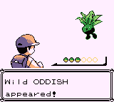
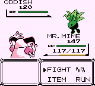

# Pokémon Solus RGB: How to modify or remove certain features

_Note_: This document is a work-in-progress.

This document details how to make tweaks to (or remove) certain things that were added in the Pokémon Solus RGB romhack. If there are some things you don't like about the romhack, you can change them before building the ROMs. Or if you want to use this romhack as a starting point for your own romhack, this document can help you get started making some changes (if you do this, all I ask is that you [revert the title screens](#revert-the-title-screens) so they don't say "Solus" in your romhack).

Jump to:
- [Non-disposable TMs](#non-disposable-tms)
- [Change sprites](#change-sprites)
- [Change the title screens](#change-the-title-screens)
- [EXP bar color](#exp-bar-color)

## Non-disposable TMs
To have TMs treated like HMs, meaning they won't be depleted after use.

In `engine/items/item_effects.asm`, search for `solusnote` and uncomment these three lines:
```
;;;;;;;;;; solusnote - these three lines would treat learning a field move from a TM the same as a HM, meaning TMs wouldn't get depleted
;xor a
;cp c
;ret c
;;;;;;;;;;
```

## Change sprites
TODO: Add these instructions after the feature to change sprite sets is implemented.

## Change the title screens
Refer to [this commit](https://github.com/Dechrissen/poke-solus-rgb/commit/8d04f9322d51b2d00aebc5febfc71b25af23559b) which shows how I changed the title screens and which extra files needed to be provided.

You can replicate the following process if you want to add your own custom title screen graphics.

1. First, I added 3 new `.png` files, one for each new title screen graphic (Solus Red, Green, and Blue).

2. Then, in `gfx/version.asm`, I swapped the files used for the title screen graphics from the vanilla ones to the Solus ones.

3. Finally, in `engine/movie/title.asm`, I modified the IDs of the tiles (`$60`, `$61`, `$62`, etc.) which used to load the graphic from each new `.png`. This is the part where it's a bit tricky if you want to create your own; you'll need to use a VRAM viewer in an emulator to show which tile of your graphic corresponds to which ID.


### Revert the title screens
Revert the changes in [this commit](https://github.com/Dechrissen/poke-solus-rgb/commit/8d04f9322d51b2d00aebc5febfc71b25af23559b) manually or with the following command.
```
git revert 8d04f93
```

## EXP bar color
On Super Game Boy, the EXP bar gets its color from the 3 palettes in `data/sgb/sgb_palettes.asm` that are used for the HP bar (`PAL_GREENBAR`, `PAL_YELLOWBAR`, and `PAL_REDBAR`). The second color in each of those palettes (originally `30,26,15` which is a pale yellow) is used for the accent color on the Pokéball icons which display at the start of battle.

<p align="center">
    
</p>

In Solus, the EXP bar currently matches that pale yellow accent color.

<p align="center">
    
</p>

If you want to change this, you can expect the Pokéball icon accent color to match the color you change it to. For example, if you want the blue color used in Gen 2's EXP bar (`04,17,31`) then the Pokéball icons will use that blue as an accent as well. This ends up looking weird. To avoid this, you can use some files I've provided that alter the look of the Pokéball icons in `gfx/battle/`.

In `engine/battle/draw_hud_pokeball_gfx.asm`, change the file used for `PokeballTileGraphics::` according to how you'd like the icons to display. I've provided two alternatives: `balls_white.2bpp` and `balls_white_empty_removed.2bpp` which remove the accent color and/or remove the empty Pokéball icon altogether. Un-comment the file you want to use.